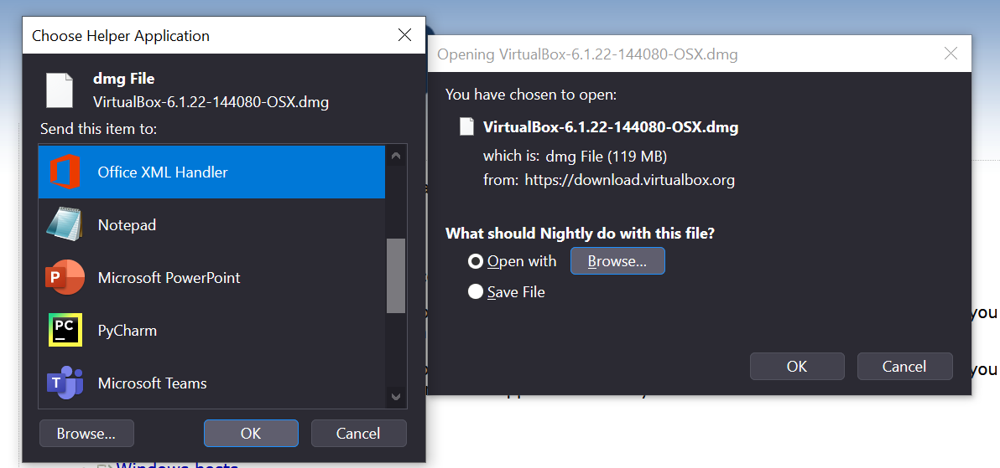

# Connected rounded tabs with gradient indicators - Proton UI (Firefox)

Firefox Proton UI minimal changes with nav-bar-connected rounded tabs, reduced compact mode, nightly color gradient accents etc.. 
Now with download popup & appPicker in dark mode!

Displays best with proton dark compact mode

Tested in Firefox Nightly 89, windows 10

How to use userChrome.css: https://www.userchrome.org/how-create-userchrome-css.html

Some of the styles applied:
* Rounded tabs connected to nav-bar with nightly color gradient active indicator
* Compact mode reduced height
* Bookmarks bar auto-hide
* titlebar spacer pre-tabs: none
* close/min/max rounded icon
* sound icon always shown when audio played. Favicon not hidden
* Close tab button appear on hover
* Tab shadow ms edge style
* Toolbar icons color purple, cyan on hover
* Loading icon and tab burst color: cyan
* Container tabs indicator at tab bottom
* Prevent tab bar size increase when tab overflow occurs
* Menu padding decreased and rounded hover style
* Url bar focus and open states with rounded nightly color gradient border
* Link hover tooltip with nightly color gradient border
* tooltips match with dark mode (with gradient border)
* sidebar bgcolor matches with proton dark color
* toolbar hamburger menu email separator- nightly gradient color applied
* sidebar splitter border and nav-bar bottom border removed
